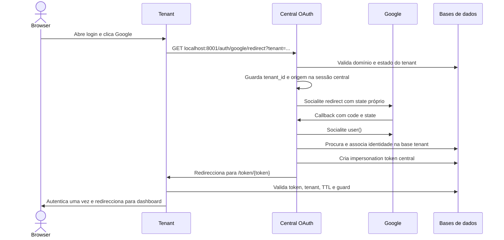

# Análise arquitectural do módulo Google Auth

**Estado:** arquitectura aplicada; decisão de ownership funcional ainda pendente  
**Data:** 2026-10-10  
**Âmbito:** login Google iniciado no tenant, callback central e autenticação de retorno por impersonation token.

## Resumo executivo

O fluxo actual funciona e a suite `tests/Feature/Auth/GoogleAuthTest.php` passou com 38 testes após a migração estrutural. O módulo separa agora início e conclusão do login em duas Actions, move o tratamento de erro para um controller tenant dedicado e centraliza os códigos de erro num enum. A arquitectura evita criar várias camadas por princípio.

Há uma decisão de produto/segurança ainda pendente: [google-auth-access-control-plan.md](google-auth-access-control-plan.md) especifica que a procura é na base central; a implementação procura o utilizador na base de dados do tenant. A migração preservou o comportamento implementado para evitar alteração funcional não aprovada. O registo das alterações e validações está em [google-auth-module-migration-status.md](google-auth-module-migration-status.md).

## Evidência analisada

Foram lidas integralmente as skills anexadas:

- `.github/skills/laravel-best-practices/SKILL.md` e todos os ficheiros em `rules/`.
- `.github/skills/socialite-development/SKILL.md`.

Também foram comparados os controllers, serviços, Actions, rotas, testes, migrations e a documentação já existente. As regras mais relevantes das skills e do projecto são: manter controllers como fronteiras HTTP; extrair Actions para operações discretas, não para satisfazer limites artificiais de linhas; injectar dependências; manter autorização e validação explícitas; usar Socialite stateful nas rotas web; e testar os resultados observáveis.

## Fluxo actual



No ambiente local, o botão usa `http://localhost:8001/auth/google/redirect`; em produção usa a rota Wayfinder no domínio central. O redirect URI carregado em configuração local foi confirmado como `http://localhost:8001/auth/google/callback`.

O início valida a origem recebida contra um domínio tenant registado e acessível (`active` ou `trial`) e guarda `google_tenant_id` e `google_tenant_login_url` na sessão central. O callback usa o state normal do Socialite, exige `email_verified` verdadeiro, procura o email na base tenant, associa `google_id` quando ainda não existe e emite o token de impersonation. O pacote Stancl valida que o token pertence ao tenant, expira-o ao fim de 60 segundos por omissão e apaga-o depois de o consumir.

## Diagnóstico da organização actual

| Área                                    | Estado observado                                                                                                                                                                                          | Consequência                                                                                                                                                             |
| --------------------------------------- | --------------------------------------------------------------------------------------------------------------------------------------------------------------------------------------------------------- | ------------------------------------------------------------------------------------------------------------------------------------------------------------------------ |
| `Central/Auth/GoogleAuthController`     | Invoca Actions e traduz resultados/falhas para respostas HTTP; ainda gere o redirect assinado de erro, logging e limpeza da sessão central.                                                               | Fronteira HTTP explícita, sem queries Eloquent nem regras de linking. O tratamento de resposta permanece deliberadamente no controller.                                  |
| `Actions/Central/Auth`                  | `BeginTenantGoogleLogin` inicia o provider e valida o tenant; `CompleteTenantGoogleLogin` verifica a identidade, consulta a base tenant, associa o Google ID e emite o token.                             | Cada Action representa um caso de uso completo e tem um ponto independente de teste/revisão.                                                                             |
| `Tenant/Auth/GoogleAuthErrorController` | Valida o código allowlisted depois do middleware `signed:relative` e faz flash local para o login.                                                                                                        | Separado do controller de sessão por ser um endpoint do transporte de erro OAuth.                                                                                        |
| `Enums/Auth/GoogleAuthError`            | Mantém os códigos e mensagens suportados.                                                                                                                                                                 | Evita códigos e textos divergentes entre callback central, endpoint tenant e testes.                                                                                     |
| Serviços Google por contexto            | Os serviços Google central e tenant sem consumidores foram removidos após pesquisa de referências.                                                                                                        | Evita dois fluxos internos com contratos de autenticação diferentes. Os serviços Facebook não foram alterados.                                                           |
| Rotas                                   | `bootstrap/app.php` carrega `routes/web.php`; `TenancyServiceProvider` carrega `routes/tenant.php`. `routes/auth.php` não é registado nesse bootstrap.                                                    | As rotas Google presentes em `routes/auth.php` não são a fonte das rotas activas; há definições antigas/comentadas a manter alinhadas ou remover numa limpeza posterior. |
| Plano existente                         | O plano Google antigo fala em procurar e autenticar um utilizador central, mas a implementação procura `App\\Models\\Tenant\\User` dentro de `tenant->run()`. A migration central também tem `google_id`. | A intenção de ownership está ambígua entre documento, schema e execução. Não mover a consulta até a regra ser decidida.                                                  |
| Testes                                  | O teste cobre sucesso, erros de conta, cancelamento, state, assinatura, tenant e falha de DB; há setup de tabelas tenant repetido junto de um helper recente.                                             | A cobertura comportamental é boa; a fixture pode ser consolidada incrementalmente sem reduzir cenários.                                                                  |

O comportamento implementado neste momento é: um email existente apenas na central não entra automaticamente num tenant. Tem de existir um utilizador com o mesmo email na base tenant seleccionada pelo botão.

## Arquitectura aplicada

A proposta segue os padrões que já aparecem em `app/Actions/Central` e `app/Actions/Tenant`: controllers injectam operações pelo construtor, e cada Action tem um `handle()` com uma operação reconhecível. O exemplo local `UserController`/`CreateUser` demonstra esse padrão; `CreateRole` mostra uma Action a usar um service já existente quando há responsabilidade reutilizável.

```text
app/
  Actions/Central/Auth/
    BeginTenantGoogleLogin.php
    CompleteTenantGoogleLogin.php
  Enums/Auth/
    GoogleAuthError.php
  Http/Controllers/Central/Auth/
    GoogleAuthController.php
  Http/Controllers/Tenant/Auth/
    GoogleAuthErrorController.php
```

### Responsabilidades

- **`GoogleAuthController` central:** receber redirect/callback, invocar a Action certa e converter resultados/falhas conhecidas em respostas HTTP. Não consulta Eloquent, não muda de contexto tenant e não conhece detalhes de associação de identidade.
- **`BeginTenantGoogleLogin`:** validar o tenant/origem, confirmar que o tenant pode autenticar, guardar o contexto mínimo na sessão central e iniciar o redirect stateful do Socialite.
- **`CompleteTenantGoogleLogin`:** obter o utilizador Socialite, verificar a identidade, procurar/vincular o utilizador no tenant acordado e criar o token de impersonation. Deve devolver um resultado simples, por exemplo o URL de retorno, sem construir resposta Inertia.
- **`GoogleAuthError`:** enumerar os códigos fixos `account`, `denied`, `state` e `failed`, centralizando o mapeamento seguro entre código e texto apresentado. Nunca transportar mensagem de excepção ou texto livre na URL.
- **`GoogleAuthErrorController` tenant:** receber apenas a rota assinada `signed:relative`, converter o código allowlisted em mensagem e usar flash (`with`) no redirect local para o login tenant. O `AuthenticatedSessionController` fica com login/password, logout e, se essa for a convenção decidida, consumo de impersonation.
- **Frontend:** continua a receber uma prop Inertia já preparada (`googleError`) e usa o `Alert` existente. Não precisa conhecer Socialite, assinatura ou código de erro do provider.

Não criar imediatamente um `GoogleProviderService`, repositório, DTO ou uma segunda camada entre cada Action e o código actual. Socialite já fornece um fake para os testes. Extrair um serviço de identidade externa só passa a compensar quando Google e Facebook partilharem efectivamente a mesma regra de vinculação, ou quando outra fronteira precisar de substituir Socialite.

## Regras de fronteira a preservar

1. O state OAuth continua sob gestão do Socialite. Não o usar para transportar tenant, URL, mensagem ou redirect.
2. O browser só pode iniciar login para um domínio registado; o servidor guarda o tenant resolvido na sessão central e o callback não volta a confiar num `tenant` livre da query.
3. O retorno cross-domain de erro é uma URL temporária assinada com código allowlisted. O `with()` é usado apenas depois de a requisição regressar ao domínio tenant, onde a sessão pertence.
4. Email Google não verificado, utilizador inexistente e identidade Google conflitante não podem autenticar nem criar utilizadores.
5. A associação de `google_id` ocorre na base tenant sob contexto tenant e respeita a unicidade existente. A sessão nunca é autenticada como utilizador central neste fluxo.
6. O token de impersonation é central, limitado a um tenant, de curta duração e de utilização única. O URL de destino deve permanecer no domínio validado desse tenant.
7. Excepções inesperadas ficam nos logs com contexto técnico suficiente, sem enviar detalhes ao browser nem expor access/refresh tokens, state ou credenciais.
8. Limpeza do contexto de tenancy/session tem de acontecer também quando a operação falha; a migração deve preservar esse comportamento e a renovação da sessão no consumo do token deve ser confirmada contra o contrato do pacote.

## Estado e evolução

As fases estruturais de caracterização, extracção das Actions e separação do erro tenant estão concluídas. A suite `tests/Feature/Auth/GoogleAuthTest.php` passou com 38 testes após a migração. O detalhe por ficheiro e validação está em [google-auth-module-migration-status.md](google-auth-module-migration-status.md).

Ficam para uma etapa seguinte: decidir a fonte canónica de utilizadores, rever a política de linking por email e limpar as rotas antigas em `routes/auth.php`. Os serviços Google sem consumidores foram removidos; Facebook foi mantido fora deste âmbito.

## Decisões pendentes para evolução funcional

1. A fonte de verdade do login é `Tenant\\User` ou `Central\\User`? O código actual e o plano anterior discordam. Qualquer mudança exige definir também como o utilizador central se relaciona com o perfil tenant e qual guard será autenticado.
2. O linking automático por email verificado é aceite para qualquer conta Google, ou deve exigir uma política/domínio institucional?
3. Google e Facebook devem partilhar a política de identidade/linking? A implementação Facebook actual não deve ser considerada equivalente apenas pela semelhança nominal.

## Critérios para fechar a evolução funcional

- Uma única regra documentada e testada para ownership do email/utilizador.
- Nenhuma rota/serviço de autenticação duplicado sem decisão explícita.
- Todos os erros mantêm resposta genérica e segura; nenhum caso recusado cria utilizador, vínculo ou token.
- Fluxo validado com Socialite fake e autenticação real em localhost, preservando callback e token tenant.

## Referências locais

- Skills anexadas: `.github/skills/laravel-best-practices/` e `.github/skills/socialite-development/SKILL.md`.
- Regras globais do projecto: `AGENTS.md`.
- Plano funcional anterior: [google-auth-access-control-plan.md](google-auth-access-control-plan.md).
- Implementação e testes avaliados: `app/Actions/Central/Auth/BeginTenantGoogleLogin.php`, `app/Actions/Central/Auth/CompleteTenantGoogleLogin.php`, `app/Enums/Auth/GoogleAuthError.php`, `app/Http/Controllers/Central/Auth/GoogleAuthController.php`, `app/Http/Controllers/Tenant/Auth/GoogleAuthErrorController.php`, `app/Http/Controllers/Tenant/Auth/AuthenticatedSessionController.php`, `routes/web.php`, `routes/tenant.php`, `routes/auth.php` e `tests/Feature/Auth/GoogleAuthTest.php`.
